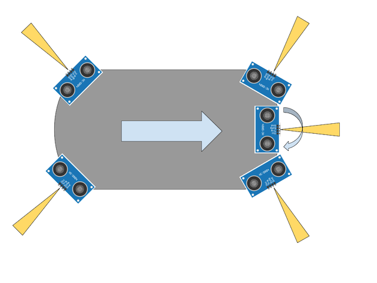
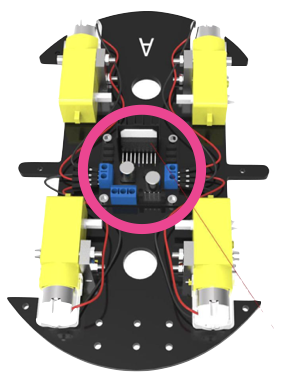
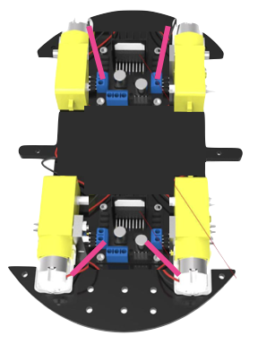

robby-five
===

> robot car ecosystem

The idea behind `robby-five` is to build different components in a robotic/autonomous (toy) car ecosystem.

Inspired by [johnny-five](http://johnny-five.io/) the main controlling unit will run on higher level languages like nodeJS or python. The underlying hardware components will be controlled by arduino hardware.

The base setup is the [elegoo smart robot car kit v1](https://www.elegoo.com/product/elegoo-uno-project-smart-robot-car-kit-v1-0/) or [v2](https://www.elegoo.com/product/elegoo-uno-project-upgraded-smart-robot-car-kit-v2-0/). However the components on it only allow to build really basic robots. To make it usable for some higher level automation it needs the base needs to be extended with:


# project ideas

## multiple sonar sensors

Hook the car up with at least 5 sonar sensors to allow better areal awareness.


The idea is to interface the sensors via an additional arduino that exposes the individual sensors over I2C.

## autonomous nodebot

re-implement the default smart robot car program using raspi & nodeJS as control device. Use sonar for obstacle detection:
* move straight until obstacle <20cm distance
* move sonar to right/left using the servo
* turn robot in the direction with most distance to next obstacle
* repeat

## improved movement

some issues with the base robot car should be improved when it comes to movement:

### steppers

DC engines do not allow for proper odometry due to varying speed, maybe use steppers

### 4WD

wheels on each side are controlled in pairs, using individual wheel control might improve maneuverability e.g. only stopping rear wheel to turn

**before:**

the original setup comes with one motor driver that allows two seperately controlled outputs. this is set up to drive the wheel pair on either side in sync.


**after:**

adding an additional motor driver would allow to drive each wheel individually. this would require 2 additional 4 additional pins on the µc to be used.


### reduce wheel grip

wheels have high grip which makes it hard to turn. having lower friction (especially lateral) would allow easier turns.

#### omni / mecanum wheels 

although quite expensive (100€ per set) the [mecanum wheels](https://www.youtube.com/watch?v=8sH1a511_q4) would allow amazing 2D movements in any direction incl strafing.
control logic would be a bit trick probably as well as possible negative influences on odometry solutions

#### 2WD

evaluate using 2 driven wheels in front and one undriven wheel in the rear for stability. this would be a cheap solution for the masses. unsure what negative side effects this would have as opposed to 4 wheels.

## remote localization

Set up a stationary camera that tracks the robot. Locate it on the map and send use this information to make the robot move within the map.

## map generation

come up with an idea how to use the sonar sensor (possibly rotating) to map a room by driving through it.

## relative robot localization

use odometry, inertial sensors, sonar/lidar feedback to allow for a control loop system aware of its past movement.

## robby wars

attach laser diodes & laser sensor to the robot. build a remote control web UI to maneuver the robot. attach LED strips to indicate health bars (or on the web UI). use your laser beam to hit other robots

# examples

There is a list of examples on how to use the underlying components within this project

## [firmata-servo](./examples/firmata-servo)

Shows how to use [johnny-five](http://johnny-five.io/) or [firmata.js](https://github.com/firmata/firmata.js/) to control a servo.

## [j5-chartist-sonar](./examples/j5-chartist-sonar)

Capture HC-SR04 sonar distance readings via johnny-five and chart them on a website.

## [raspi-led](./examples/raspi-led)

Use raspberry pi IO to play with LEDs using johnny-five / raspi-io

# troubleshooting

## serialport does not install on raspbian

for some reason jessy doesn't ship with git installed which the `serialport` module needs during its make.

```sh
apt-get install git
```

## node module installation fails using `yarn``

yes it happens.. guess it's something with the compilation use `npm install` instead
